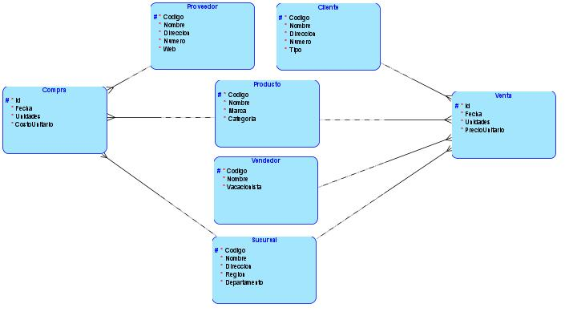

*Universidad de San Carlos de Guatemala*  
*Facultad de Ingenieria*  
*Escuela de Ciencias y Sistemas*  
*Seminario De Sistemas 2*  
*Segundo Semestre 2024*  

___
## **Proyecto**
### **Proceso ETL**
___
**201908355 - Danny Hugo Bryan Tejaxún Pichiyá**

## Optimización del Sistema de Análisis y Reportes para SG-Food

El sistema aborda los problemas actuales de rendimiento y carga en la base de datos central, proporcionando una solución eficiente para el análisis y la generación de reportes en intervalos de tiempo requeridos.

## Proceso ETL
* ### Extracción
    * **Archivos de Texto**: Los datos se extraen de archivos de texto delimitados por el carácter pipe (`|`), con extensiones `.comp` para compras y `.vent` para ventas. Estos archivos contienen registros con posibles errores como campos en blanco, números negativos o mal escritos.
    * **Bases de Datos**: Se conectan dos bases de datos `SQL Server` para extraer información adicional relevante para el análisis y reporte.

* ### Transformación
    * **Limpieza de Datos**: Durante la transformación, se corrigen errores de los archivos de entrada o tablas pivote, según sea el caso, como valores nulos y formatos incorrectos. Se valida y limpia la información luego de cargarla en las tablas pivote.
    * **Integración de Datos**: Los datos de las dos bases de datos y los archivos de texto se combinan en usando `Merge` de `SSIS`, preparándolos para la carga final en el Data Warehouse.

* ### Carga
    * **Data Warehouse**: Los datos transformados se cargan en el Data Warehouse, que está diseñado con un modelo de constelación para manejar dos tipos de operaciones: compras y ventas.

## Modelo Constelación
El modelo de Data Warehouse implementado es un modelo de Constelación. Este enfoque es adecuado debido a la existencia de dos tipos principales de operaciones en SG-Food: compras y ventas. El modelo de constelación permite manejar estas dos operaciones mediante dos tablas de hechos separadas, facilitando un análisis más eficiente y una mejor estructura de datos.

### Modelo Lógico

### Modelo Físico

### Tablas de Dimensión:
* **Cliente**: Información sobre los clientes, incluyendo su código, nombre, dirección, número de teléfono y tipo.

| No | Campo | Tipo |
| - | - | - |
| 1 | `PK` `Codigo` | `Codigo NVARCHAR(64)` |
| 2 | `Nombre` | `NVARCHAR(128)` |
| 3 | `Direccion` | `NVARCHAR(1024)` |
| 4 | `Numero` | `INT` |
| 5 | `Tipo` | `NVARCHAR(16)` |
* **Producto**: Detalles de los productos, como código, nombre, marca y categoría.

| No | Campo | Tipo |
| - | - | - |
| 1 | `PK` `Codigo` | `Codigo NVARCHAR(64)` |
| 2 | `Nombre` | `NVARCHAR(256)` |
| 3 | `Marca` | `NVARCHAR(256)` |
| 4 | `Categoria` | `NVARCHAR(32)` |
* **Proveedor**: Datos de los proveedores, incluyendo código, nombre, dirección, número de teléfono y sitio web.

| No | Campo | Tipo |
| - | - | - |
| 1 | `PK` `Codigo` | `Codigo NVARCHAR(64)` |
| 2 | `Nombre` | `NVARCHAR(512)` |
| 3 | `Direccion` | `NVARCHAR(1024)` |
| 4 | `Numero` | `INT` |
| 5 | `Web` | `NVARCHAR(16)` |
* **Sucursal**: Información sobre las sucursales, con código, nombre, dirección, región y departamento.

| No | Campo | Tipo |
| - | - | - |
| 1 | `PK` `Codigo` | `Codigo NVARCHAR(64)` |
| 2 | `Nombre` | `NVARCHAR(32)` |
| 3 | `Direccion` | `NVARCHAR(1024)` |
| 4 | `Region` | `NVARCHAR(32)` |
| 5 | `Departamento` | `NVARCHAR(32)` |
* **Vendedor**: Información de los vendedores, incluyendo código, nombre y estado de vacacionista.

| No | Campo | Tipo |
| - | - | - |
| 1 | `PK` `Codigo` | `Codigo NVARCHAR(64)` |
| 2 | `Nombre` | `NVARCHAR(128)` |
| 3 | `Vacacionista` | `INT` |

### Tablas de Hechos:
* **Compra**: Registra las compras realizadas, con campos para la fecha, unidades compradas, costo unitario, y referencias a los proveedores, productos y sucursales correspondientes.

| No | Campo | Tipo |
| - | - | - |
| 1 | `Fecha` | `Date` |
| 2 | `Unidades` | `INT` |
| 3 | `CostoUnitario` | `FLOAT` |
| 4 | `FK` `CodProveedor` | `NVARCHAR(64)` |
| 5 | `FK` `CodProducto` | `NVARCHAR(64)` |
| 6 | `FK` `CodSucursal` | `NVARCHAR(64)` |
* **Venta**: Registra las ventas realizadas, incluyendo la fecha, unidades vendidas, precio unitario, y referencias a los clientes, vendedores, productos y sucursales correspondientes.

| No | Campo | Tipo |
| - | - | - |
| 1 | `Fecha` | `Date` |
| 2 | `Unidades` | `INT` |
| 3 | `PrecioUnitario` | `FLOAT` |
| 4 | `FK` `CodCliente` | `NVARCHAR(64)` |
| 5 | `FK` `CodVendedor` | `NVARCHAR(64)` |
| 6 | `FK` `CodProducto` | `NVARCHAR(64)` |
| 7 | `FK` `CodSucursal` | `NVARCHAR(64)` |